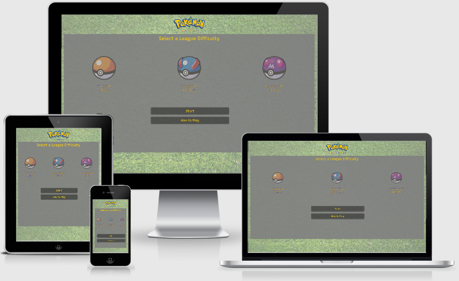

# Pokemon Matching Pairs

---

## Table of Contents

---

1. [UX](#ux)
   - [User Stories](#user-stories)
   - [Viability](#project-viability)
   - [Responsive](#responsive)
   - [Frameworks](#frameworks-used)
   - [Typography](#typography)
   - [Colors](#colors)
   - [icons](#icons)
   - [Wireframes](#wireframes)
   - [Logo](#logo)
2. [Features](#features)
   - [Existing Features](#existing-features)
   - [Features left to implement](#features-left-to-implement)
3. [Technologies Used](#technologies-used)
   - [Front End Technologies](#front-end-technology)
4. [Testing](#testing)
   - [Validators](#validators)
   - [Testing Methods](#testing-methods)
5. [Deployment](#deploy)
   - [Local Deployment](#local-deployment)
   - [Remote Deployment](#remote-deployment)
6. [Credits](#credits)
   - [Content](#content)
   - [Media](#media)
   - [Acknowledgements](#acknowledgements)

---

## UX

---

### User Stories

This game has been created specifically for young children. (3-7 year olds)

- As a user, I want to have fun with a simple game

- As a user, I want to choose a different experience depending on the difficulty. 

- As a user, I want to know if I lose

- As a user, I want to be rewarded with recognition for winning. 

- As a user, I want some instructions so I know what to do

- As a user, I want to be told when it matches

- As a user, I want the game to run on different screen sizes.

- As a user, I want to be told in different ways whether the chosen pokemon match or not.

- As a user, I want to improve my hand eye co ordination and develop simple early ICT usage skills. 

### Project Viability

|     | Feature                        | Importance | Viability |
| --- | ------------------------------ | :--------: | --------: |
| A   | Win/Lose conditions            |     5      |         4 |
| B   | Have different difficulties    |     5      |         4 |
| C   | Animations                     |     3      |         5 |
| D   | Sound effects                  |     5      |         3 |
| E   | Rules and how to play screen   |     3      |         5 |
|     | Total                          |     21     |        21 |

### Responsive

[Am I Responsive?](http://ami.responsivedesign.is/#) was used to test how responsive the website is on different devices.

### Frameworks Used

- [Bootstrap](https://getbootstrap.com/)
- Bootstrap is an open source library with access to reusable bits of code for html, css and javascripts. 

- [jQuery](https://jquery.com/)
- jQuery is an open source library that makes using javascript easier and quicker. It simplifies a variety of multiple lines of javascript code by putting it into a single line of jquery code. 

- [jQuery UI](https://api.jqueryui.com/) 
- jQuery UI is a user interface interactions which allows the user to control more aspects of their code, by building further upon jQuery (includes interactions, effects, widgets, and themes). This has been used in the project for the pokemon animations as they come out of the pokeballs and shake. 

### Typography

I used the font recursive throughout my project as it looked most similar to the font used in the Nintendo game boy games.

1 [Google Font](https://fonts.google.com/) was used throughout this website:
- ["Recursive", sans-serif;](https://fonts.google.com/specimen/Recursive)

### Colors

Colours have been chosen that reflect the pokemon logo, and some of the themes from the popular series.
-  `#fbcb04` Used throughout as Pokemon's Primary colour in the logo.
-  `#3a6eb8` Used throughout as Pokemon's Secondary colour in the logo.
-  `#ff1010` used to make the win page text stand out
-  `#e9e799` used for the background of the win page as a soft warm colour for positivity. 
-  `#25689d` used for the lose page text as this and the background colour fit cleanly together, but colder colours help emit sadness.
-  `#c2cccf` used for the lose page background, as its a colder colour and stands nicely behind the text and image

### Icons

[Font Awesome 5.13.1](https://fontawesome.com/)
  The following 4 Font Awesome icons were used.
  - [Sound]https://fontawesome.com/icons/volume-up?style=solid - used on page to mute website

### Wireframes

- Click here to see the project [Wireframes](wireframes.md)

### Image modifications

- [GIMP](https://www.gimp.org/) was used to resize the grass image so it was lower pixals and would load quicker 

##### Back to [top](#table-of-contents)
---

## Features

---

### Existing Features

- Win/Lose conditions

  - Timer set up so when it hits zero a modal comes up to say game over
  - If all pokemon are out of the pokeballs, a modal comes up that says "you win" 

- Have different difficulties 

  - Players can choose a pokeball at the start to represent easy, nmormal and hard mode. Upon activating the start button, the specific pokeballs of that stage pop up, with more pokeballs as the difficulty gets harder.

- Animations

  - Pokemon bounce as they pop out of the pokeballs

- Sound effects 

  - Sounds are taken from the pokemon gameboy game. 
  - Sound plays when a ball is clicked and pokemon pops out.
  - Different sound plays when they dont match. 
  - Another different sound plays when they do match
  - Winning sound effect plays when all pokemon are out of the pokeballs
  - a losing sound plays when the timer hits zero (only works on desktop as mobile devices don't allow for modals to play music)
  
- Rules and how to play screen 

  - Group of pages set up which explain the rules of the game, accessible from the main menu.

### Features to Implement

- A bug in the console says "# Uncaught (in promise) DOMException: The play() request was interrupted by a call to pause()." (# goes up incrementally when a new sound plays). 
This requires full understanding of DOMException and unsynchronicity and synchronicity in audio.  Future understanding of this concept will allow it to be fixed, however 
the game currently plays and audio works, so it is in a usable state. 

##### Back to [top](#table-of-contents)

---

## Technologies Used

---

- HTML

  - This project uses HTML to create the main functions of the website.
  - [HTML](https://en.wikipedia.org/wiki/HTML)

- CSS

  - This project uses CSS to override the Bootstrap elements and apply the determined styling
  - [CSS](https://en.wikipedia.org/wiki/CSS)

- Javascript

 - This project uses Javascript to create functions, rules and effects in order to make the game work as intended.
 - [Javascript](https://en.wikipedia.org/wiki/JavaScript)

##### Back to [top](#table-of-contents)

---

## Testing

---

### Validators

- HTML

  - [W3C HTML Validator](https://validator.w3.org/) "Document checking completed. No errors or warnings to show."

- CSS

  - [W3C CSS Validator](https://jigsaw.w3.org/css-validator/) "Congratulations! No Error Found. This document validates as CSS level 3 + SVG !"

- JSHint

  - [JSHint javascript Validator](https://jshint.com/) 

### Testing Methods

For information on the testing, follow the link to the document [here](testing.md)

##### Back to [top](#table-of-contents)
---

## Deployment

---

\*The [Pokematch repository](https://github.com/adam181189/Pokematch) was developed using GitHub Workspaces, and all commits were pushed to GitHub using Git.

\*Commits were pushed every time important sections were completed in order to create useful ongoing checkpoints.

### Local Deployment

- *In order to locally deploy the website, the following was actioned (using Windows 10): 
1. Navigate to GitHub repository:
    - [adam181189 repository](https://github.com/adam181189?tab=repositories)
2. Open the Pokematch repository:
    - [Pokematch repository](https://github.com/adam181189/Pokematch)
3. Click on the code dropdown option and select download zip
4. Create a new folder called Pokematch and unzip the files in that new folder
5. Now iis is required, this can be done by going to run and typing in appwiz.cpl
6. Now click on turn windows features on or off
7. scroll down to internet information services
8. Open folder and open Web Management tools and tick IIS Management Console
9. Go to This PC and click on the local disk that houses the operating system.
10. Open folder called inetpub
11. inside here find wwwroot
12. Move your pokematch folder into this folder. 
13. Go to the following link http://localhost/pokematch/index.html

### Remote Deployment

- Deployed Site:

  - https://adam181189.github.io/Pokematch/

*In order to deploy the website, the following was actioned:
1. Navigate to GitHub repository:
    - [adam181189 repository](https://github.com/adam181189?tab=repositories)
2. Open the Pokematch repository:
    - [Pokematch repository](https://github.com/adam181189/Pokematch) 
3. Click on the **Settings** tab at the top:
    - [Settings](https://github.com/adam181189/Pokematch/settings)
3. Scroll down to the **GitHub Pages** section.
4. The first drop-down field should be **Source** with *None* pre-selected.
5. Select **master branch** from the list.
6. The page should refresh.
7. Scroll down to the **GitHub Pages** section.
8. There will now be a deployed link:
    - The site is published at [https://adam181189.github.io/Pokematch/](https://adam181189.github.io/Pokematch/)

##### Back to [top](#table-of-contents)
---

## Credits

---

### Content

- Most written content was my own.
- "Welcome to the world of Pokemon, I am the Pokemon professor" is a phrase used at the start of the pokemon games by Professor Oak so was included to introduce him as part of the "how to play" section.

### Media

- [Pixabay](https://pixabay.com/photos/grass-lawn-backdrop-background-84622/) - Grass background image
- [Bulbapedia](https://bulbapedia.bulbagarden.net/wiki/Main_Page) All other images came from this website. All images are copyrighted property of Nintendo.
- [Sounds](https://www.sounds-resource.com/game_boy_gbc/pokemonredblueyellow/sound/17241/) All used sounds were found and downlaoded from this page.
- [Hourglass image](https://www.clipartmax.com/middle/m2i8d3K9i8m2A0Z5_hourglass-clipart-image-hour-glass-clip-art/) Used as part of the timer.

### Acknowledgements

Inspiration for this project was drawn from a video game series I have enjoyed since I was a child, and the need for a simple ICT programme that the 
children can use in my job. We can use this to assess how well the children in our group can complete a program from start to finish, and also help 
to build up memory function skills. 

I also want to thank some of the members on slack May-2020 group as they looked at my project and suggested some changes, and bugs that were in my project. 
I also want to the thank the children at the pre school i work at for playing the game and telling me what they enjoyed about it. 

##### Back to [top](#table-of-contents)
